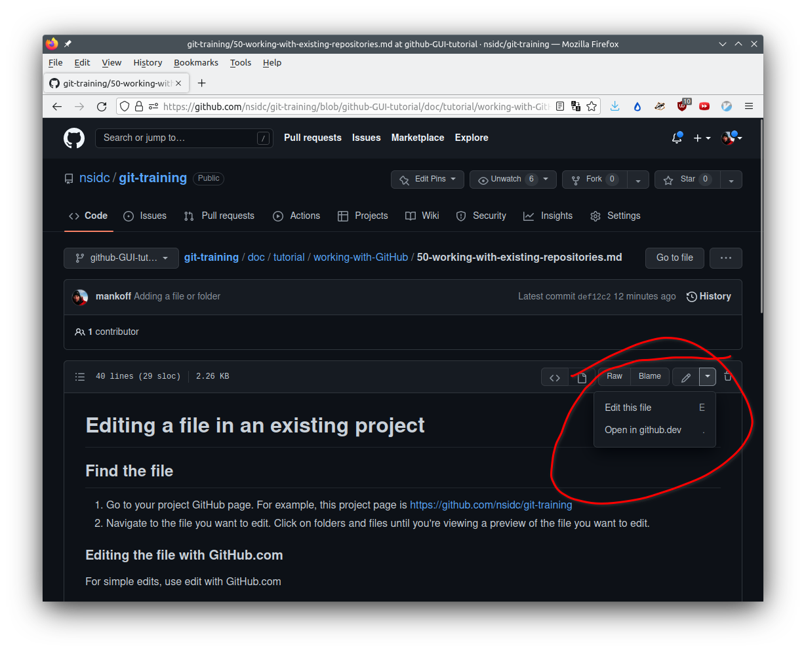
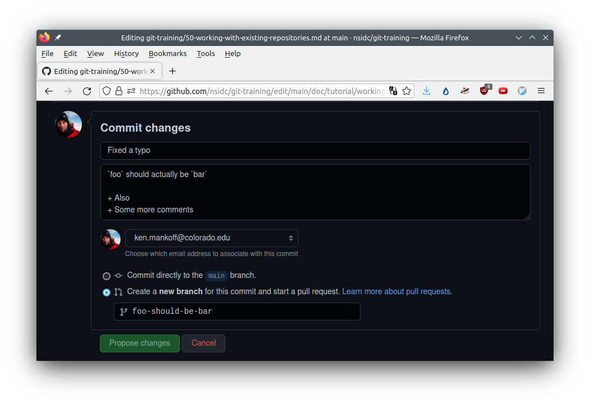

# Editing a file in an existing project

## Find the file

1. Go to your project GitHub page. For example, this project page is https://github.com/nsidc/git-training
2. Navigate to the file you want to edit. Click on folders and files until you're viewing a preview of the file you want to edit

## Edit the file

For simple edits, use edit with GitHub.com

1. Click on the `pen` icon, or select `Edit this file` from the `v` dropdown next to the pen icon

2. Edit the file
3. When done editing, it is important to leave a `commit message` documenting what changes you made
   1. Leave a short one-line commit message
   2. If more details are needed or may be useful, leave an extended discription
   3. If the change is small, or you are working alone on your own project, you can commit directly to the branch you are on. This is probably the `main` branch
   4. If the change is large, there are other people working on the project, or you want to discuss the change with someone before finalizing it, select `Create a new branch for this commit and start a pull request`
      + If you commit to a new branch and create a pull request, see How To Merge Pull Requests
4. Select the `Commit changes` button

<!--

Suggest leaving this out for now

### Editing with `GitHub.dev`

For more involved edits, maybe including mulitple files, using GitHub.dev. The GitHub.dev interface is a powerful code editor in your browser. For example, you can work on multiple files with tabs, or you can use split view and view realtime rendered Markdown files as you edit them.

0. When viewing an project, folder, or file on GitHub.com, edit the URL from `.com` to `.dev` to enter the GitHub.dev application.
2. Edit the file or files
3. When you are done with your edits, select the `Source Control` icon (`CTRL+SHFT+G`) in the sidebar.
4. Review your changes. 
5. If the change is small, you can commit directly to the branch you were on when browsing the files on GitHub.com
6. If the change is large, you can create a new branch from the `...` menu.
7. When you're finished, enter a commit message in the dialog box and select CTRL+Enter to finalize the commit
8. Finally, use the hamburge icon `=` in the top left and select `Go to Repository`

-->
